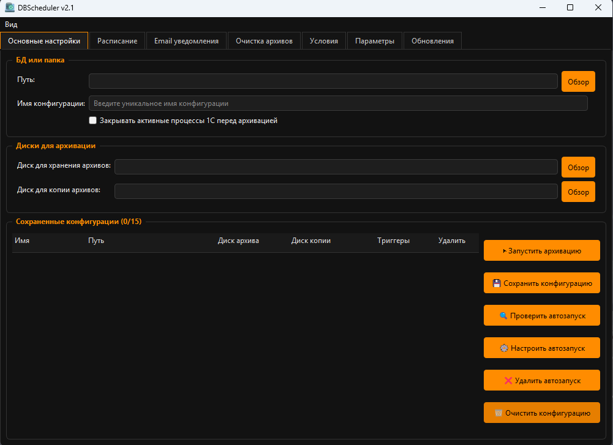
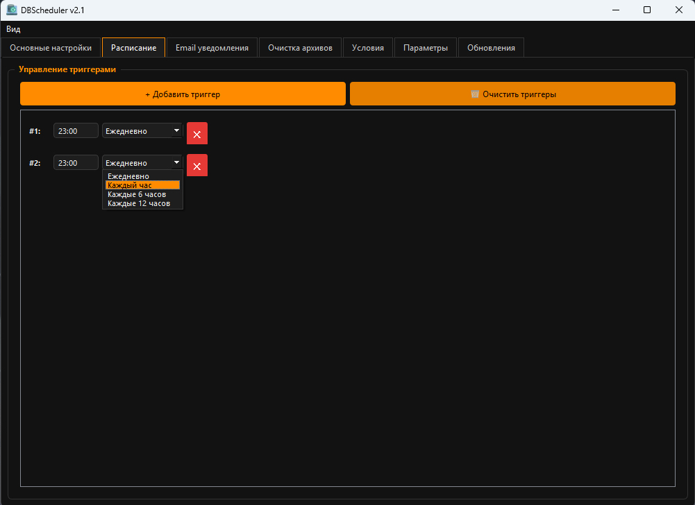
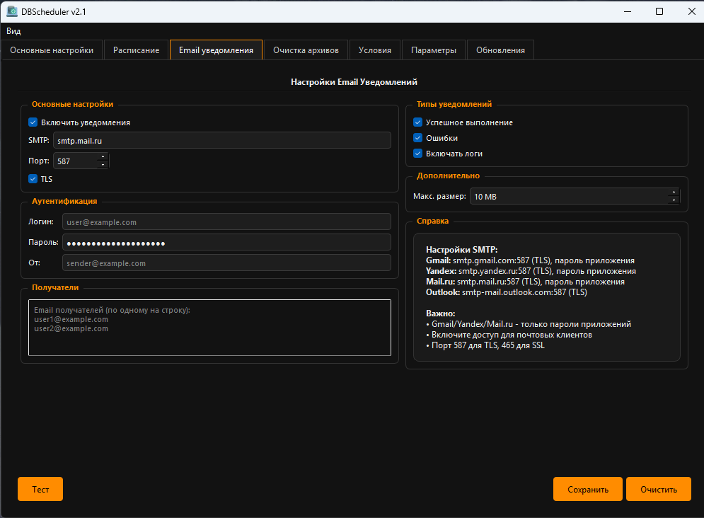

<!-- Banner -->

<h1 align="center">🗂️ DBScheduler v2.1</h1>

  <b>Простая и надёжная программа для автоматического резервного копирования файлов и баз данных</b> 
  Поддерживает Windows 10/11 и Windows Server 2012 R2+

  
  
  
  
  

---

## 🚀 Основные возможности

- 🔄 Создание ZIP-архивов с резервными копиями баз или любых каталогов  
- 💾 Автоматическое копирование архива на дополнительный диск или сетевую папку  
- ⏰ Гибкое расписание: ежедневно, каждый час, каждые 6/12 часов, несколько триггеров  
- ⚙️ Настройка автозапуска через **Планировщик заданий Windows**  
- 📧 Email-уведомления об успешном или неудачном резервном копировании  
- 🧩 Возможность закрытия процессов `1cv8.exe` / `1cv8c.exe` перед архивацией  
- 🗃️ Локальное хранение конфигураций и логов  

---

## 💡 Преимущества

- Удобный интерфейс — интуитивная настройка без скриптов  
- Несколько конфигураций и расписаний  
- Полностью автономная работа — подходит для серверов и рабочих станций  
- Отправка уведомлений на почту  
- Отказоустойчивая и безопасная работа  

---

## ⚙️ Системные требования

- **ОС:** Windows 10/11, Windows Server 2012 R2 и новее  
- **Дополнительно:**  
  - Права на чтение/запись каталогов архивации  
  - Доступ к SMTP-серверу (для Email-уведомлений)  
  - Microsoft Visual C++ Redistributable (последняя версия)
  - Для Windows Server 2012R2 убедитесь в наличии SSL сертефикатов

---

## 🧭 Установка и запуск

1. Скачайте установщик для вашей платформы (**x86/x64**), для серверной версии DBScheduler_Server_x64\x86_Setup_v2.0.exe
2. Запустите и следуйте инструкциям  
3. После установки откройте **DBScheduler** из меню **Пуск**

---

## 🪄 Настройка

### 🧱 Основные настройки
- Укажите путь к базе или каталогу для архивации  
- Настройте каталог хранения архивов и каталог для копий  
- При необходимости включите закрытие процессов 1С перед бэкапом  
- Сохраните конфигурацию

### ⏰ Расписание
- Добавляйте триггеры (ежедневно, каждый час, каждые 6/12 часов)  
- Настраивайте автозапуск через Планировщик заданий Windows  
- Поддерживается несколько триггеров для одной конфигурации  

### 📧 Email уведомления
- Укажите SMTP-сервер, порт, логин, пароль, отправителя и получателей  
- Настройте отправку уведомлений о результатах архивации  

---

## 🛠️ Хранение данных

- Конфигурации: `%LOCALAPPDATA%\Backup1C\backup_configs.db`  
- Логи: в корневой папке программы  

---

## 🖼️ Скриншоты

| Главный экран | Расписание | Email уведомления |
|----------------|-------------|--------------------|
|  |  |  |

---

## 📋 Рекомендации

- Размещайте копию архивов на отдельном физическом диске  
- Включайте закрытие процессов 1С при файловых базах 1C 
- Проверяйте свободное место и доступность путей  
- Периодически выполняйте тестовое восстановление
- Перед использованием читайте руководство "GUIDE"! 

---

## 🧰 Поддержка

📧 **Email:** zip@file-py.ru  
💬 **Telegram:** [t.me/+3PdeknJPJRc4NGNi](https://t.me/+3PdeknJPJRc4NGNi)  
🌐 **ВКонтакте:** [vk.com/urban_solution](https://vk.com/urban_solution?from=groups)

---

## 🧾 Лицензия

© 2025 **ZipFile**  
Свободно распространяется для некоммерческого использования.  
Для корпоративного применения свяжитесь с автором.
